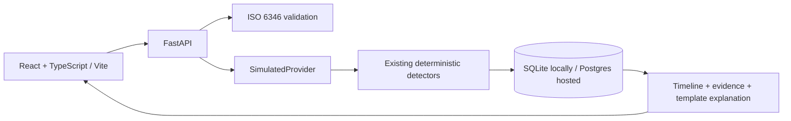

# Middle Watch

**Controlled synthetic benchmark: 40,000 rows, 2,393/2,393 injected exceptions caught,
100% family recall, and 0 false positives among 2,393 reported incidents.** These are
generated cases, not independent real-world accuracy estimates. The file contains
39,849 unique identifiers; the unchanged harness counts rows and labelled identifiers
differently. [Definitions, per-family results and near-misses](docs/benchmark/README.md).

Middle Watch is an open-source exception-monitoring demo built by Anthony Denis.
Paste up to 100 container numbers, upload a one-column CSV, or load the sample list.
Inspect ranked exceptions, event timelines, and the exact fields and thresholds that
triggered each finding. Once data is connected, tracking is easy to automate;
knowing what matters is the hard part.

**Simulated feed — journeys are generated, no carrier is contacted.**
Only `SimulatedProvider` supplies journeys. No real shipment or customer data is used.

[Planned v2 demo](https://themiddlewatch.com) ·
[Existing static demonstration](https://anthonydenis01.github.io/middle-watch-agent/demo.html) ·
[Source](https://github.com/anthonydenis01/middle-watch-agent/tree/app) ·
[10-minute walkthrough](docs/DEMO_SCRIPT.md) · [Hosting setup](docs/DEPLOYMENT.md)

The v2 host is not yet release-verified. Hosting setup and public checks precede the
`v2.0.0` tag. Python 3.11+ and Node 22.12+ are required for local development.

## Architecture



Five detector families cover routing changes, vessel swaps, dwell, ETA drift, and
transit-time discrepancies. They retain the v1 rules, tests and eval harness.
The HTTP adapter supplies generated journeys and stores field-level evidence;
model output never controls findings or severity. The original agentic CLI remains
available with `python -m middlewatch --help`.

## Run locally without keys

From the repository root, in PowerShell:

```powershell
git switch app
python -m venv api/.venv
.\api\.venv\Scripts\python.exe -m pip install -r api/requirements.txt
.\api\.venv\Scripts\python.exe scripts/serve_local.py
```

In a second terminal:

```powershell
cd web
npm ci
npm run dev
```

Open http://localhost:5173. API health is http://127.0.0.1:8000/health and the
interactive API reference is http://127.0.0.1:8000/docs. The launcher applies Alembic
migrations before starting. SQLite is stored in ignored `api/middlewatch.db`.
On macOS/Linux use `api/.venv/bin/python` in place of the Windows executable.
No `.env` is required. To customize, copy `.env.example` to the ignored root `.env`;
never commit populated values. Browser builds may receive only the public API origin
in `VITE_API_URL`; no service keys belong in the web environment.

CSV format (UTF-8, exactly one column, up to 100 rows and 200,000 bytes):

```csv
container_number
CSQU3054383
```

Lowercase and surrounding whitespace are normalized; repeated normalized numbers
produce one row. Invalid numbers remain visible with a reason and never reach the
provider. The 100-input cap is applied before deduplication.

## API and safeguards

| Route | Purpose |
|---|---|
| `GET /health` | Version and database reachability |
| `POST /api/validate` | Validate `{ "numbers": [...] }` |
| `POST /api/watchlists` | Create from numbers |
| `POST /api/watchlists/csv` | Create from multipart `file` |
| `POST /api/watchlists/sample` | Fixed 25-number sample |
| `GET /api/watchlists/{id}` | Ranked rows and summary |
| `GET /api/containers/{id}` | Timeline, evidence and explanation |
| `GET /api/meta/eval` | Committed controlled synthetic benchmark results |
| `POST /api/benchmark` | Fixed generated benchmark used by HTTP verification |

- Runs and benchmark requests share a 20-per-IP sliding-hour allowance. Rejected
  attempts count; `429` includes `Retry-After`. Reads and validation remain available.
  The bounded limiter is process-local and resets on restart: deploy one worker and
  one instance. A shared limiter is required before scaling out. Generic forwarded
  headers are ignored. On Render only, a private proxy peer may supply one valid
  `True-Client-IP`; otherwise limits use the peer address. Live release checks must
  confirm header spoof resistance and isolation between independent client IPs.
- Raw bodies are bounded before parsing: 16,000 bytes normally, 210,000 bytes for the
  CSV multipart envelope, with a separate 200,000-byte file cap. Errors have a stable
  `error.code`, a safe message and the simulation notice; submitted values are omitted.
- Watchlists expire after 24 hours. Reads delete expired records and cascading child
  rows. A background cleanup runs at startup and every five minutes while the process
  is awake. A suspended host deletes on wake; physical deletion may therefore lag
  expiration. Run `python -m api.services.retention` for an explicit cleanup.
- CORS allows the two project domains and localhost. Set `NETLIFY_SITE_NAME` to the
  exact owned site slug to allow that site's preview origins. `CORS_ORIGINS` accepts
  extra explicit origins separated by commas; never use a wildcard.
- No sign-in, visitor email collection or application cookies. UUID links grant
  access to generated watchlists until expiry; this is a synthetic-data demo.

## Optional services

Both services are off with empty environment values and are unnecessary for the demo.
The generated journeys always come from `SimulatedProvider`.

`ANTHROPIC_API_KEY` plus `ANTHROPIC_MODEL` enables a bounded explanation request when
a flagged container is first inspected. One attempt is cached per container under
normal sequential use, including failures. Timeouts, malformed responses and service
errors preserve the deterministic template. The screen labels model drafts for human
review. Evidence and severity remain unchanged. Concurrent first inspections can
produce more than one request; leave this option off for a cost-free public demo.

`RESEND_API_KEY`, `ALERT_FROM`, and `ALERT_TO` enable an explicit operator command:
`python -m api.notify WATCHLIST_UUID`. It sends only a simulated summary to the fixed
configured recipient, using the watchlist ID as an idempotency key. Visitors cannot
trigger email. Missing configuration returns a disabled result; failures leave the
watchlist intact. Do not enable services until their account access and spending
controls have been reviewed by the owner.

Protocol references: [Claude API](https://platform.claude.com/docs/en/api/overview)
and [Resend send endpoint](https://resend.com/docs/api-reference/emails/send-email).

## Verify

Run from the root with the API virtual environment's Python:

```powershell
.\api\.venv\Scripts\python.exe -m pytest tests api/tests -q
.\api\.venv\Scripts\python.exe -m alembic upgrade head
.\api\.venv\Scripts\python.exe -m alembic check
.\api\.venv\Scripts\python.exe scripts/verify_baseline.py
.\api\.venv\Scripts\python.exe scripts/evaluate_http.py
.\api\.venv\Scripts\python.exe scripts/check_repository.py
cd web
npm run build
npm run lint
npm test
npx playwright install chromium
npm run e2e
```

The controlled synthetic benchmark fixes seed 7 and snapshot date 2026-08-03.
Both comparisons must equal every P0 accuracy field; runtime varies by machine.
Browser checks exercise the built web app against the real local API, including
375-pixel layouts, keyboard access and automated accessibility checks. GitHub Actions
runs these checks on `app`, `main`, and pull requests. Hosting verification later uses
`scripts/evaluate_http.py --url YOUR_API_ORIGIN` against only this project's API.

## License

[MIT](LICENSE).
